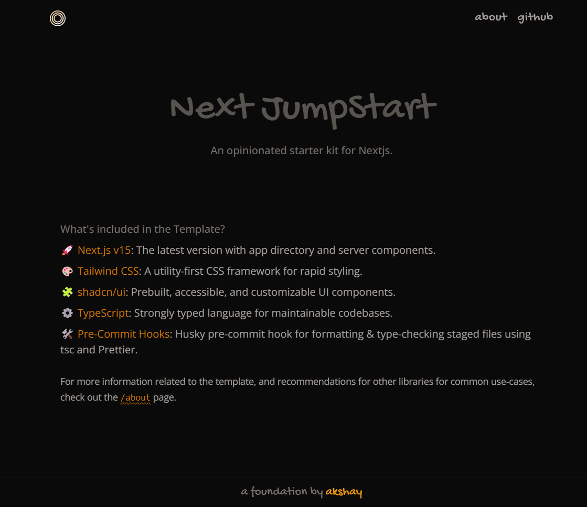

# Next JumpStart

This is a starter template, designed to kickstart your Next.js projects with the latest technologies and tools.



---

## What's Included

- **🚀 Next.js v15** -
  The latest version of Next.js, featuring the new App Directory and Server Components for an enhanced developer experience.

- **🎨 Tailwind CSS** -
  A utility-first CSS framework to create responsive and modern designs efficiently.

- **🧩 shadcn/ui** -
  Prebuilt, accessible, and customizable UI components to speed up development.

- **⚙️ TypeScript** -
  A strongly typed language that ensures maintainable and robust codebases.

- **🛠️ Pre-Commit Hooks** -
  Husky pre-commit hook configured for formatting and type-checking staged files using TypeScript (`tsc`) and Prettier.

For more information and recommendations on additional libraries for common use-cases, visit the `/about` page.

---

## Getting Started

### Installation

1. Clone the repository:

   ```bash
   git clone https://github.com/akshay-rajput/next-jump-start.git
   ```

2. Install dependencies:

   ```bash
   npm install
   # or
   yarn install
   ```

3. Run the development server:

   ```bash
   npm run dev
   # or
   yarn dev
   ```

4. Open [http://localhost:3000](http://localhost:3000) in your browser to see the template in action.

---

## Customization

### Fonts

- By default, this template uses two Google Fonts. You can customize them in the `app/layout.tsx` file by updating the font imports and variables.

### Dark Mode

- To add Dark mode, check out [shadcn/ui docs](https://ui.shadcn.com/docs/dark-mode). Alternatively you can programmatically add `"dark"` class to the body for toggling dark mode for components.

### Pre-Commit Hooks

- Husky ensures all staged files are formatted and type-checked before committing. Modify the `.husky` configuration as needed.

---

## License

This template is open-source and available under the [MIT License](LICENSE).
